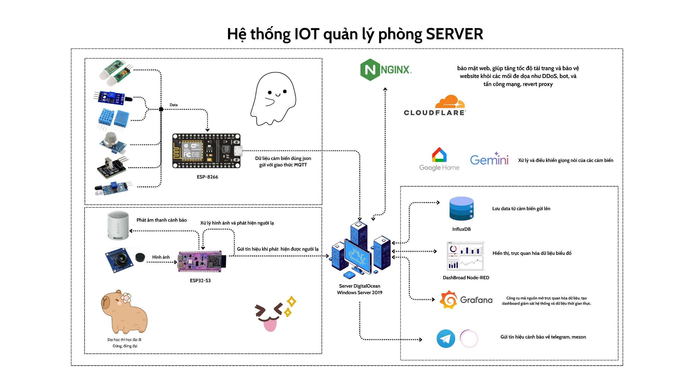
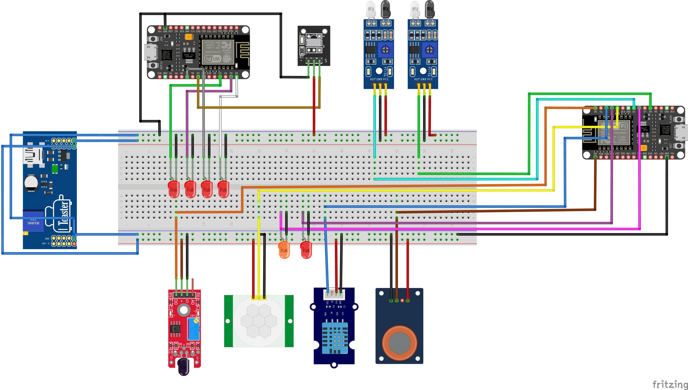

# Smart Home IoT System

## Project Overview
This project is a comprehensive IoT-based smart home system designed to monitor and control various environmental parameters and devices. It integrates multiple sensors, a camera module, and an IR remote control system, leveraging MQTT for communication, Node-RED for data processing, and Grafana for visualization. The system is deployed with a secure HTTPS setup using Nginx as a reverse proxy.
## Members and roles
**Phạm Gia Khánh And Nguyễn Thành Trọng**
- Cấu hình và lập trình nhúng cho Esp8266, Esp32Cam, cảm biến, Led, xây dựng và triển khai model AI phát hiện người lạ, dự đoán cháy. Lập trình trực quan trên Node-red, đẩy dữ liệu dạng time series vào database Influxdb. Gửi cảnh báo lên Mezon, Telegram

**Nguyễn Minh Phúc**
- Cấu hình Windows server 2019, cài đặt phần mềm, deploy, cài đặt hệ thống mạng tường lửa port đồng thời giám sát và quản trị hệ thống (VPN, DHCP, DNS,....). Xây dựng các cơ chế bảo mật, hỗ trợ các thành viên sử dụng các công cụ và hỗ trợ lập trình. Tích hợp Gemini điều khiển qua giọng nói

**Trương Mạnh Quỳnh And Bùi Như Ý**
- Cấu hình và truy vấn dữ liệu từ Influxdb, trực quan hóa dữ liệu trên Grafana, phân tích và xây dựng mô hình dự đoán dữ liệu trên các cảm biến và đánh giá mô hình

## Features
- **Sensor Monitoring**:
  - PIR motion sensor for detecting movement.
  - Flame sensor for fire detection.
  - IR sensors for sequential detection (e.g., entry/exit tracking).
  - MQ135 gas sensor for air quality monitoring.
  - DHT11 sensor for temperature and humidity.
- **Camera Integration**:
  - ESP32-CAM captures and sends JPEG images via MQTT for remote monitoring.
- **Data Processing and Visualization**:
  - Node-RED processes sensor data and camera images, with a dashboard for user interaction.
  - InfluxDB stores time-series data.
  - Grafana provides real-time dashboards for sensor data visualization.
- **Secure Communication**:
  - Nginx reverse proxy with HTTPS and self-signed certificates.
  - MQTT broker (Mosquitto) for secure device communication.
- **Automated Deployment**:
  - Python script to launch all services (Node-RED, Mosquitto, InfluxDB, Grafana, Nginx).

## System Architecture
The system architecture illustrates how devices communicate through MQTT and how data flows to the backend services for processing and visualization.

## Hardware Components
- **ESP8266 NodeMCU**:
  - Runs `Sensor.ino` for sensor data collection.
  - Connects PIR, flame, IR, MQ135, and DHT11 sensors.
- **ESP32-CAM**:
  - Runs `espcam_send_to_node_red.ino` for image capture and MQTT publishing.
- **ESP8266 with IR**:
  - Runs `control_led_ir_remote_f.ino` for IR-based AC control and LED management.
- **Sensors**:
  - PIR (motion), flame, IR (x2), MQ135 (gas), DHT11 (temperature/humidity).
- **Other**:
  - LEDs, buzzer, IR receiver, and IR LED for AC control.

## Circuit Assembly Guide
This section provides a visual guide to assembling the hardware components. The image below shows the connections for the ESP8266 NodeMCU, sensors, LEDs, buzzer, and IR components.

### Steps:
1. **ESP8266 NodeMCU (Sensor Board - Sensor.ino)**:
   - Connect PIR sensor signal pin to GPIO2 (D4).
   - Connect flame sensor signal pin to GPIO16 (D0).
   - Connect IR sensor 1 signal pin to GPIO14 (D5).
   - Connect IR sensor 2 signal pin to GPIO15 (D8).
   - Connect MQ135 analog output to A0.
   - Connect DHT11 data pin to GPIO4 (D2).
   - Connect LED 1 to GPIO12 (D6).
   - Connect LED 2 to GPIO0 (D3).
   - Connect buzzer to GPIO13 (D7).
   - Power sensors: VCC to 3.3V or 5V (check sensor specs), GND to GND.

2. **ESP8266 NodeMCU (IR Control Board - control_led_ir_remote_f.ino)**:
   - Connect LED 1 to GPIO0 (D3).
   - Connect LED 2 to GPIO2 (D4).
   - Connect LED 3 to GPIO5 (D1).
   - Connect LED 4 to GPIO13 (D7).
   - Connect LED 5 to GPIO16 (D0).
   - Connect IR receiver signal pin to GPIO14 (D5).
   - Connect IR LED (sender) anode to GPIO4 (D2) via a current-limiting resistor.
   - Connect status LED to GPIO12 (D6).
   - Power IR components: VCC to 3.3V, GND to GND.

3. **ESP32-CAM**:
   - Ensure the camera module is properly seated and powered.
   - Connect to WiFi as per `espcam_send_to_node_red.ino`.
   - Power with a stable 5V source.

4. **Power Supply**:
   - Use a stable 5V power source for both ESP8266 boards and ESP32-CAM.
   - Ensure sensors and peripherals are powered appropriately (3.3V or 5V as per specs).
   - Use a common ground for all components.

6. **Access the System**:
   - Website: `https://ateamiuh.me`
   - Node-RED Editor: `https://ateamiuh.me/nodered/`
   - Node-RED Dashboard: `https://ateamiuh.me/ui/`
   - Grafana: `https://ateamiuh.me:3000`
   - InfluxDB: `https://ateamiuh.me:8086`

## Future Improvements
- Add IR Remote system: Implement air conditioner control to adjust temperature appropriately.
- Add audio system: Play a "hello" sound when a user enters the server room and a "goodbye" sound when they leave.
